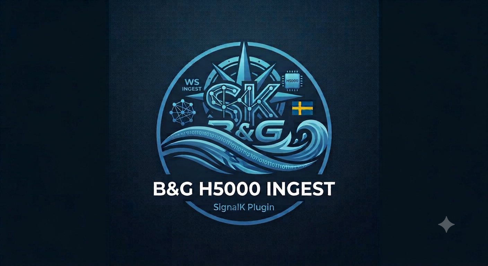

# signalk-h5000-websocket


A native Signal K server plugin designed to tap into the high-frequency telemetry stream broadcasted by the B&G H5000 CPU via its internal WebSocket interface.

By pulling data directly from the H5000 web server over Ethernet, this plugin bypasses NMEA 2000 gateway bottlenecks, allowing high-frequency metrics (like Wind Speed, Angle, Boat Speed, and Heel) to flow seamlessly into your Signal K data core for logging, instrumentation, or polar calculation.

---

## What's new in 2.1.1

- **Fix: opening a chart while sorted by "Most active" or "Most oscillating" could make it look like the chart vanished.** Those sort modes re-rank rows live as values change, so a row you'd just opened a chart on could get shuffled elsewhere in the (long) list the moment its value updated — the chart wasn't actually gone, just scrolled out of view. Any row with an open chart is now pinned to a stable spot at the top of the table so this can't happen.

## What's new in 2.1.0

- **Record & compare in the live mapping UI.** The discovery scan now keeps a rolling history (up to 2000 samples) per Data ID while it runs, and computes live stats — range and sign-change count — for each row. Sort the table by "Range" or "Sign changes" to instantly surface whichever channel is actually moving, and click the 📈 button on any row to expand an inline sparkline chart of its recent history (with a zero-reference line when the data spans zero). This replaces the old workflow of eyeballing a single live snapshot or asking someone to correlate an ad-hoc script capture by hand — now you can wiggle a sensor (e.g. the wheel/rudder) during a scan and immediately see, sorted and charted, which ID actually responded.
- Confirmed via this workflow on 2026-09-06: Data ID 146 is definitively the rudder angle channel (a timestamped, correlated oscillation test — 6 turning points against 5 deliberate wheel movements — matched exactly). No mapping change was needed; this was a confirmation of the existing mapping.

## What's new in 2.0.0

- **Fixed a `sysVal` unit-inconsistency bug.** Earlier versions used `sysVal` directly whenever the H5000 supplied it, on the assumption it was always pre-converted to SI. Live testing on 2026-08-16 showed this is unreliable: depth channels report `sysVal` in feet (not meters), wind/boat-speed channels report `sysVal` as an unconverted duplicate of `val` (still knots), and some angle-like channels report `sysVal` as an unconverted duplicate of `val` (still degrees, not radians). The plugin now always converts `val` using the configured conversion type and no longer reads `sysVal` at all.
- **Added a live discovery/mapping UI**, served at the plugin's own page (`/plugins/signalk-h5000-websocket/` on your Signal K server, also reachable from the **Webapps** menu). It opens a short-lived, separate WebSocket scan (doesn't touch your live Signal K data) so you can watch every broadcasting ID tick in real time, compare it against the plotter, and map a Signal K path + conversion type per row with a dropdown — no Dev Tools, no manual JSON editing, no SSH required. Saving reconnects the production feed with the new mapping immediately.
- The classic Dev Tools discovery workflow described below still works and is a fine fallback, but the live UI is now the recommended way to map channels.

---

## Architecture Overview

```
 +-------------------------+               +-----------------------------------+
 |  B&G H5000 CPU          |               | Raspberry Pi (or Boat Server)     |
 |  Web Server             |               |                                   |
 |                         |               |  +-----------------------------+  |
 |  [WS Stream: Port 2053] |=============> |  | Signal K Server              |  |
 +-------------------------+   Ethernet/   |  | (Plugin: signalk-h5000-ws)  |  |
                               Wi-Fi       |  +-----------------------------+  |
                                           +-----------------------------------+
```

The B&G H5000 CPU exposes its internal data dictionary through Navico's GoFree Data Service on WebSocket port `2053`. The service is subscription-based: this plugin connects as a client, sends a `DataReq` subscription for every Data ID you have mapped in the Signal K UI, and receives repeating `{"Data":[...]}` batches in return. Each value's `val` field is converted to its standardized, SI-compliant Signal K path using your configured conversion type. **Note:** earlier versions of this plugin used `sysVal` directly when present, assuming it was already SI — this was found to be unreliable (see "What's new in 2.0.0" above) and is no longer used.

---

## Sensor Discovery & UI Configuration Workflow

### Recommended: the built-in Live Mapping UI (2.0.0+)

1. Open Signal K's admin UI and go to **Webapps**, or navigate directly to `http://<your-pi-ip>:3000/plugins/signalk-h5000-websocket/`.
2. Confirm the H5000 IP/port at the top and click **Start scan**.
3. Watch values tick in live. Cross-check against the plotters/mast displays to identify what you're looking at.
   * **Tip:** to identify an unknown channel, actuate the physical control (e.g. turn the wheel, hoist the sail) while the scan is running, then sort the table by **Range** or **Sign changes** and click the 📈 chart button on the top candidates — the row whose sparkline visibly correlates with the timing of your movement is the right one. This is far more reliable than picking a channel from a single snapshot value.
4. Pick a Signal K path and conversion type from the dropdowns for each channel you've confirmed.
5. Click **Save Mappings** — the plugin reconnects its production feed with the new mapping immediately.
6. Click **Stop scan** when done, or let the scan window expire (default 5 minutes) — it always auto-stops so it never runs indefinitely.

### Fallback: Discover Data IDs via Browser Developer Tools

Because every modern sailboat is equipped with a distinct set of sensors (e.g., custom linear rudder feedback, forestay load cells, mast rotation, or tank gauges), the H5000 maps variables dynamically based on how your network was commissioned.

1. Connect a laptop or nav-station computer to the boat's network and navigate to the H5000 web interface (`http://<YOUR_H5000_IP>`).
2. Press **F12** (or Right-Click -> *Inspect*) to open your browser's Developer Tools.
3. Select the **Network** tab, click the **WS** (WebSockets) filter sub-tab, and reload the page.
4. Click on the active connection (typically ending in `:2053`) and select its **Messages** or **Frames** tab.
5. You will see a live, high-frequency waterfall stream of JSON packets. Actuate your target sensor (e.g., move the rudder wheel or crank the forestay tension) and note which `DataId` updates its value in real-time.

### Input Mappings Visually into Signal K (standard config screen, always available)

1. Open your Signal K Admin Portal (`http://<your-pi-ip>:3000`).
2. Navigate to **Server** -> **Plugin Config** and select **B&G H5000 WebSocket Ingest** from the list.
3. Under the **Custom Sensor Mappings** array section, click **Add Item** for each telemetry channel you want to capture.
4. Fill out the visual fields:
   * **H5000 Data ID:** The numerical ID discovered using the live UI or your Dev Tools (e.g., `41` for SOG, `42` for STW).
   * **Signal K Path:** The official standard path where the metric belongs (e.g., `steering.rudderAngle`), or a custom path for data the spec does not cover (e.g., `rigging.forestay.tension`).
   * **Unit Conversion Type:** Select the mathematical translation required. *Note: Signal K strictly enforces SI base metrics internally (Meters per Second for speed, Radians for angles/rotation, and Newtons for rigging tension).*
     * *None:* Pass-through raw value.
     * *Speed:* Knots to Meters/Second.
     * *Angle:* Degrees to Radians.
     * *Temperature:* Fahrenheit to Kelvin.
5. Click **Submit**. The plugin will instantly reload, compile your mapping dictionary, and begin feeding the standard data streams.

---

## Confirmed mappings (as of 2026-09-06)

See `troubleshoot.md` for the full investigation history. Current best-known set:

| Data ID | Signal K Path | Conversion |
|---|---|---|
| 41 | navigation.speedOverGround | speed |
| 42 | navigation.speedThroughWater | speed |
| 37 | navigation.headingMagnetic | angle |
| 146 | steering.rudderAngle | angle |
| 140 | environment.wind.angleApparent | angle |
| 141 | environment.wind.angleTrueWater | angle |
| 142 | environment.wind.directionTrue | angle |
| 46 | environment.wind.speedApparent | speed |
| 47 | environment.wind.speedTrue | speed |
| 77 | environment.depth.belowTransducer | none |

Note: 123 (AttitudePitch) / 124 (AttitudeRoll) are the vendor-correct Data IDs for pitch/roll but were confirmed **not** to actually broadcast from this particular H5000 unit — pitch/roll are sourced from a separate IMU (racebox) plugin instead.

Note: 146 (rudder angle) was independently re-confirmed on 2026-09-06 with a live, timestamp-correlated oscillation test using the record & compare workflow above (see "What's new in 2.1.0").

---

## Installation

The plugin is published on npm as [`signalk-h5000-websocket`](https://www.npmjs.com/package/signalk-h5000-websocket).

### Option 1: Signal K Appstore (recommended)
1. Open your Signal K Admin Portal (`http://<your-pi-ip>:3000`).
2. Navigate to **Appstore** -> **Available** and search for `signalk-h5000-websocket`.
3. Click **Install**, then restart the server when prompted.

### Option 2: npm from the command line
SSH into your server and install the package into Signal K's configuration directory:

```bash
cd ~/.signalk
npm install signalk-h5000-websocket
sudo systemctl restart signalk-server
```

---

## Validation & Troubleshooting

### Data Browser Verification
Once configurations are saved and the plugin badge displays an active connection state, navigate to the **Data Browser** in the Signal K side menu. Your custom defined paths (e.g., `rigging.forestay.tension`) will stream cleanly in real-time alongside your native hardware streams, ready to be utilized by dashboard apps (like Kip or InstrumentPanel) or time-series data loggers (like InfluxDB).

### Inspecting Live Debug Messages
If variables fail to populate correctly or the connection drops:
1. Navigate to **Server** -> **Debug Log** within the Signal K Web UI.
2. Put `signalk-h5000-websocket` in the search box to filter low-level logging messages.
3. You will see detailed real-time traces tracking web socket server connections, connection retries, parsing validations, and missing ID warnings.

### Protocol notes
- Client → server: `{"DataReq":[{"id":N,"repeat":true,"inst":0}]}`
- Server → client: `{"Data":[{id, val, sysVal, valStr, valid, damped, dampedVal}, ...]}`
- `sysVal` is not reliably SI-converted — the plugin no longer uses it (see "What's new in 2.0.0").
